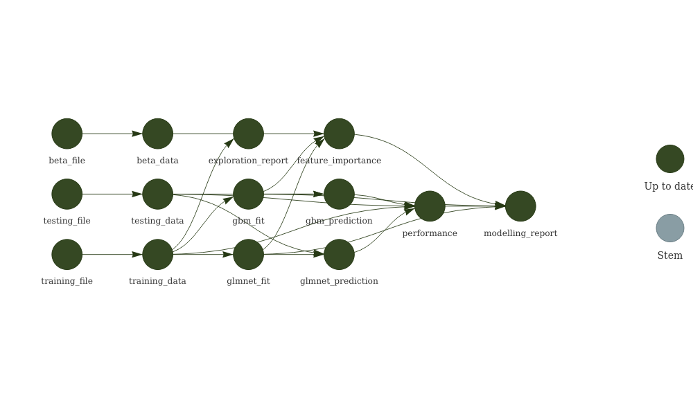

Showcasing a reproducible workflow in R
================
Guillem Hurault
2022-04-29

-   [File structure](#file-structure)
-   [Reproducibility](#reproducibility)
-   [Testing](#testing)
-   [Possible improvements](#possible-improvements)
-   [Current analysis status
    (cf. targets)](#current-analysis-status-cf-targets)

The purpose of this project is to showcase best coding practices in R.
The analysis is adapted from a coding test, where fake data is generated
and the goal is to develop models to predict an outcome variable (count
outcome). The proposed analysis does not attempt to find the best
possible model (the true data generating mechanism is known) but is
merely here to illustrate a reproducible workflow.

## File structure

This project is organised as a research compendium, with a similar
structure as R packages:

-   Functions/helpers are located in the [`R/`](R/) directory. There is
    only a single script [`functions.R`](R/functions.R). Note that
    functions are documented using an [Roxygen2
    skeleton](https://roxygen2.r-lib.org/).

-   [`data/`](data/) contains the training set, testing set and true
    coefficients as csv files.

-   [`data-raw`](data-raw/) contains a script
    ([`generate_fakedata.R`](data-raw/generate_fakedata.R)) to generate
    the fake data.

-   Analysis reports/scripts are located in the [`analysis/`](analysis/)
    directory. There are two Rmarkdown documents, one for the
    exploratory data analysis
    ([`exploration.Rmd`](analysis/exploration.Rmd)) and one for the
    modelling ([`modelling.Rmd`](analysis/modelling.Rmd)).

-   HTML reports are located in [`docs/`](docs/) and can be accessed on
    the GitHub project site:

    -   [Exploratory data
        analysis](https://ghurault.github.io/reproducible-workflow/exploration.html)
    -   [Modelling
        report](https://ghurault.github.io/reproducible-workflow/modelling.html)

-   Tests are located in [`tests/`](tests/) folder.

-   [`renv/`](renv/) and [`renv.lock`](renv.lock) are folders/files used
    by the renv package to manage package dependencies (see details
    below). The [`.Rprofile`](.Rprofile) is also created by renv to
    launch renv at the start of a new session.

-   [`_targets.R`](_targets.R) and [`_targets/`](_target/) are
    files/folders used by the targets package to manage the
    computational workflow (see details below). [`run.R`](run.R) and
    [`run.sh`](run.sh) are also created by targets and store the command
    to run the pipeline (namely `targets::tar_make()`).

Research compendiums are often R organised as de facto R packages, but I
find this is not always helpful. In particular:

-   renv is better suited to reproduce the computational environment
    than a DESCRIPTION file. For example, DESCRIPTION file does not
    specify the exact version of the packages needed to reproduce an
    analysis. We could use renv within a package, but then we have to
    follow two standards to specify the computational environment.
-   A package is designed to share code, which is not the main focus of
    a one-off analysis.

Having said that, this structure makes it easy to convert the project to
an R package if needed (especially if the documentation is already
written using Roxygen skeleton). A package could notably be useful to
take advantage of the package ecosystem, for example to quickly build a
website for the project using [pkgdown](https://pkgdown.r-lib.org/) or
easily implement continuous integration with GitHub Actions.

## Reproducibility

I use [Docker](https://www.docker.com/),
[renv](https://rstudio.github.io/renv/index.html) and
[targets](https://docs.ropensci.org/targets/index.html) to ensure the
analysis is fully reproducible. Briefly,

-   Docker is used to run the analysis on a virtual environment
    (container), irrespective of the machine that is being used and the
    system’s configuration.
-   renv is used to manage package dependencies and reproduce the
    computational environment by restoring the project library.
-   targets is used to specify the computational workflow (i.e. how to
    produce output files from scratch).

To reproduce the analysis on a Docker container, make sure you have
installed [Docker](https://www.docker.com/) on your computer first.

### tldr

To reproduce the analysis:

1.  Clone this repository.
2.  In the command line (e.g. Git Bash on Windows), navigate to the
    project directory.
3.  Build the Docker image with
    `docker build . -t rstudio/reproducible-workflow`.
4.  Run the container with
    `MSYS_NO_PATHCONV=1 docker run -d --rm -p 8787:8787 -e DISABLE_AUTH=true -v $(pwd):/home/rstudio/reproducible-workflow -v /home/rstudio/reproducible-workflow/renv rstudio/reproducible-workflow`.
5.  Go to [`http://localhost:8787/`](http://localhost:8787/).
6.  Open the `reproducible-workflow` directory and the click on
    `reproducible-workflow.Rproj` to open the RStudio project.
7.  Run `targets::tar_make()`.

### Explanations

The [`Dockerfile`](Dockerfile) specifies the configuration of this
virtual environment. Here I am setting up a Linux machine where I
install R, RStudio Server, various system dependencies and the packages
needed to reproduce the analysis (using renv).

[renv](https://rstudio.github.io/renv/index.html) is used to manage
package dependencies. The details of the packages needed to reproduce
the analysis is stored in [`renv.lock`](renv.lock) and configuration
files and the project library (ignored by git) is stored in
[`renv/`](renv/). After installing `renv` itself
(`install.packages("renv")`), the project library can be restored by
calling `renv::restore()`.

Instruction 3) builds the docker image of the current directory
(cf. `.`) and name it `rstudio/reproducible-workflow` (cf. `-t` option).

Instruction 4) runs the container as a daemon (detached mode, cf. `-d`
option). In addition,

-   `MSYS_NO_PATHCONV=1` is only useful if the command is run on Git
    Bash on Windows, as it prevents file path conversion when mounting
    volume.
-   `-rm` removes the containers when it is exited.
-   `-p 8787:8787` publish the container to `http://localhost:8787/`.
-   `DISABLE_AUTH=true` disables login (otherwise password is generated
    automatically or can be specified as an option).
-   `-v $(pwd):/home/rstudio/reproducible-workflow` mounts the current
    directory in the `/home/rstudio/reproducible-workflow` in the
    container. This means that local files are available in the
    container, and that files that changes made inside the container
    happens on the local files as well. In addition,
    `-v /home/rstudio/reproducible-workflow/renv` prevents from mounting
    the `/renv` directory.

Once the virtual environment is set up and the RStudio project is
opened, the analysis can be reproduced using targets. The workflow is
declared in [`_targets.R`](_target.R) and information that the package
needs is stored in [`_targets/`](_targets/). We can inspect the current
status of the pipeline by using `targets::tar_visnetwork()` and run the
pipeline with `targets::tar_make()`.

## Testing

Unit tests are implemented using the [testthat
package](https://testthat.r-lib.org/). The test are written in R scripts
beginning by `test-` in [`tests/testthat/`](tests/testthat/) and can be
run by sourcing [`tests/testthat.R`](tests/testthat.R). Currently, the
tests implemented here are only here to showcase how we can perform unit
tests outside a package environment. In practice, more/better tests
should be implemented.

## Possible improvements

-   Set up continuous integration, e.g. when there is a push to the
    remote repository, run the analysis in GitHub actions (cf. tldr
    above) and publish the report (and potentially the pipeline status),
    in addition to running unit tests.

## Current analysis status (cf. targets)

<!-- -->

The pipeline dependency graph can also be accessed
[here](https://ghurault.github.io/reproducible-workflow//tar_network.html)
as an HTML widget.
